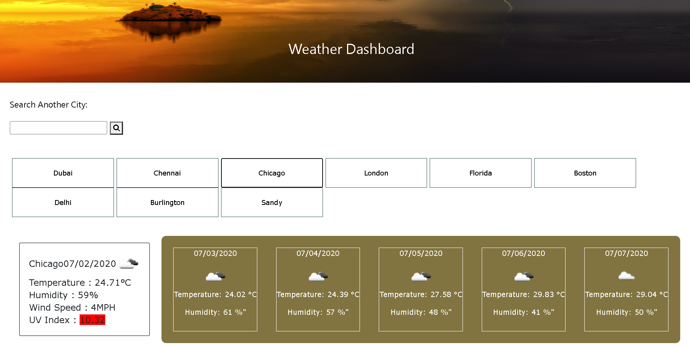
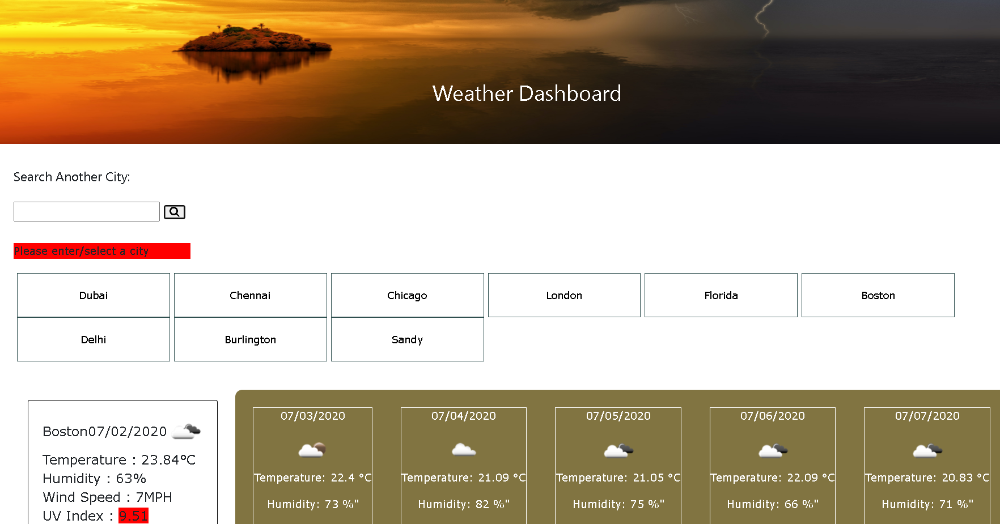
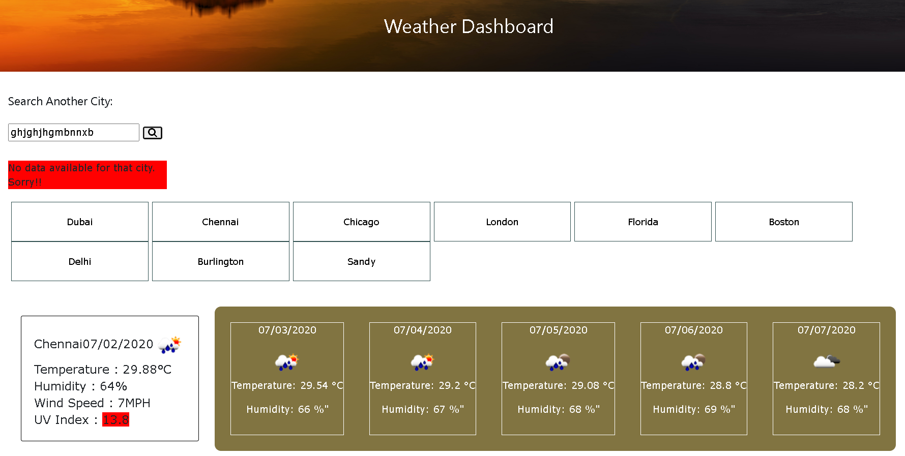
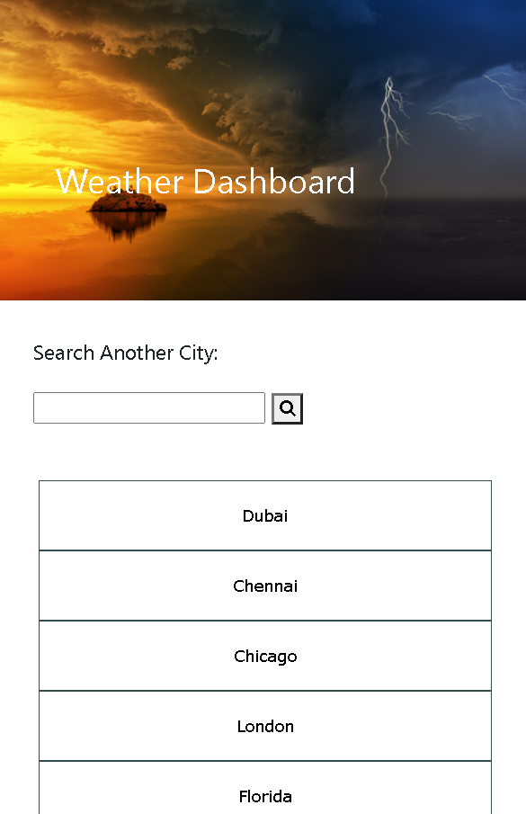
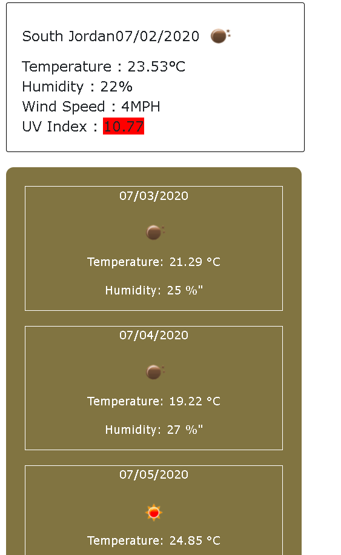

This assignment focuses on using Server-side API for displaying Weather Dashboard. Third-party APIs give the flexibility to access their data and functionality by making requests. Building a weather dashboard with dynamically updated HTML and CSS. This application is made responsive using media queries. 

Server-side API used: [OpenWeather API](https://openweathermap.org/api) 

## Application

* When the user searches for a city, it should present with current and future weather conditions of that place so that they can plan their trip accordingly.
* The user can see various details like city name, the date, an icon representation of weather conditions, the temperature, the humidity, the wind speed, and the UV index.
* The color for uvIndex that indicates whether the conditions are favorable, moderate, or severe.
* The user should also see the 5-day forecast that displays the date, an icon representation of weather conditions, the temperature, and the humidity.
* When the user clicks on cities, they should see the weather forecast.
* When the weather dashboard is clicked, the user sees the last searched city forecast.

## Implementation

* The files are index.html, script.js, style.css.
* Mostly, the code is written in script.js as this is a dynamically updated webpage.
* Moment.js library is used for getting the current date and well as adding upcoming dates.
* When the user enters the URL, the user sees the last searched city forecast. If there is no data on localStorage, then predefined city value is shown.
* When the user enters a city name/ clicks the available cities, they will be presented with data.
* When the user clicks the search button without entering text, then "Please enter/select a city" is shown.
* When the user enters a wrong city name by mistake, then "No data available for that city" message is shown. The entered text won't be saved in search history on local storage.

#### Screenshots

Here's the link to my developed Website : [ServerSideAPI-WeatherDashboard](https://yakinia.github.io/06-ServerSideAPIs-WeatherDashboard/)

##### References

StackOverflow- 5 DayForecast  :[5 DayForecast](https://stackoverflow.com/questions/49640174/building-a-5-day-forecast-using-open-weather-api-ajax-and-js) 
StackOverflow- JQueryForEach : [ JQueryForEach](https://stackoverflow.com/questions/6208052/jquery-each-for-objects) 
YouTubeVideo - AJAXCall : [YouTube- AJAXCall](https://www.youtube.com/watch?v=KT6Jaxl0JM4) 
Moment.js Library: [Moment.js library](https://momentjs.com/) 
Open Weather App: [Open Weather API](https://openweathermap.org/forecast5) 
W3Schools : [W3Schools- ImageAlignment](https://www.w3schools.com/howto/howto_css_image_text.asp)